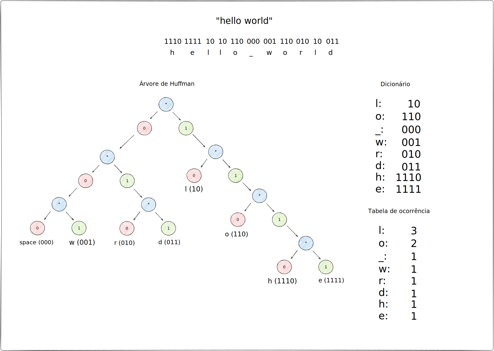
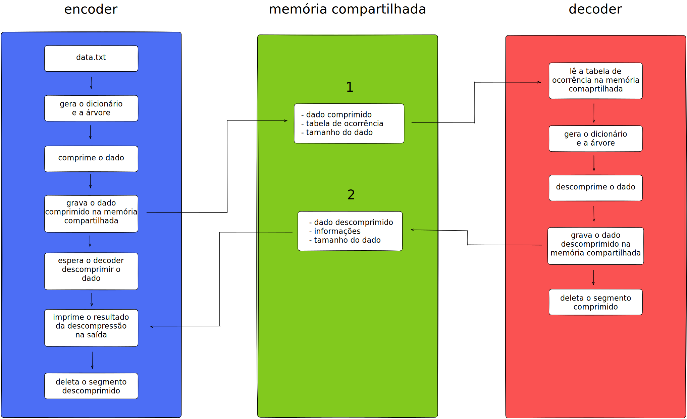

# 42 Labs 4º Edição
## Desafio
O [desafio](SUBJECT.md) consiste no desenvolvimento de uma aplicação de análise e compressão de dados. Essa aplicação utilizará o algoritmo de compressão [Huffman](https://pt.wikipedia.org/wiki/Codifica%C3%A7%C3%A3o_de_Huffman) e poderá receber múltiplos dados onde, uma vez que comprimido, deve ser descomprimido e coletar informações pertinentes para a análise do processo e dado.

Para isso, você criará dois programas: encoder e decoder. O encoder receberá o dado a ser comprimido e exibirá suas informações vindas do decoder. Já, o decoder descomprimirá o dado e irá enviá-lo ao encoder com suas informações, onde será exibido. Os programas devem se comunicar utilizando [shared memory operations](https://www.geeksforgeeks.org/ipc-shared-memory/).

A [linguagem C](https://en.wikipedia.org/wiki/C_(programming_language)) será utilizada para o desenvolvimento e não há bibliotecas externas permitidas.

### Algoritmo/Codificação de Huffman
O algoritmo de [Huffman](https://pt.wikipedia.org/wiki/Codifica%C3%A7%C3%A3o_de_Huffman) é um método de compressão que usa as probabilidades de ocorrência dos símbolos ou caracteres no conjunto de dados a ser comprimido para criar códigos para esses símbolos com tamanho reduzido.

Uma árvore binária é construída a partir de uma tabela de ocorrência dos símbolos, começando pelos símbolos de menor frequência sendo agrupados em um nó da árvore até que todos os símbolos estejam agrupados. A soma da ocorrência da junção dos dois símbolos é usada como valor determinante, de modo que os
símbolos mais frequentes estejam no topo da árvore.

Cada nó da árvore representa 0 ou 1, quando uma folha ou aresta da árvore é atingida, a concatenação dos valores binários resultantes pode ser traduzida usando o dicionário construído usando a tabela de ocorrência.



### Estrutura da Aplicação


### Memória Compartilhada / Shared Memory Operations
Para a comunicação entre processos são geralmente utilizados pipes ou named pipes, onde um processo envia dados na entrada padrão de outro processo.
Mas existe ainda outra maneira, "memória compartilhada". Através da memória compartilhada um segmento de memória é criado com um id, sendo possível outro programa ler e gravar neste segmento ou endereço de memória, sendo possível a criação de aplicações com um maior controle e complexidade.
As chamadas de sistema utilizadas são:

**ftok():** é usado para gerar uma chave única.

**shmget():** ```int shmget(key_t, size_t size,int shmflg);``` após a conclusão bem-sucedida, **shmget()** retorna um identificador para o segmento de memória compartilhada.

**shmat():** Antes de poder usar um segmento de memória compartilhada, você precisa se
conectar a ele usando **shmat().** ```void *shmat(int shmid, void *shmaddr, int shmflg);```
**shmid** é o id da memória compartilhada. **shmaddr** especifica o endereço a ser usado, mas devemos defini-lo como zero e o sistema operacional escolherá automaticamente o endereço.

**shmdt():** Quando você terminar de o usar segmento de memória compartilhada, seu programa deve
se desconectar dele usando **shmdt().** ```int shmdt(void *shmaddr);```

**shmctl():** Quando você se desconecta da memória compartilhada, ela não é destruída. Então, para destruir **shmctl()** é usado. ```shmctl(int shmid,IPC_RMID,NULL);```

Exemplo de como alocar memória compartilhada para a frase "hello world":
```c
#include <sys/ipc.h>
#include <sys/shm.h>
#include <string.h>
#include <stdio.h>

int main(void)
{
    // ftok para gerar uma chave única
    // o primeiro argumento deve ser um arquivo existente
    key_t key = ftok("/tmp/shmfile", 1);

    // shmget retorna um shmid, um id único para o segmento de memória
    int shmid = shmget(key, sizeof(char) * strlen("hello world"), 0666 | IPC_CREAT);

    // shmat para se ligar ao segmento e receber o endereço da memória
    char *str = (char *)shmat(shmid, (void *)0 ,0);

    // strcpy para copiar a string para o segmento compartilhado
    strcpy(str, "hello world");

    // shmdt para se desligar do segmento compartilhado
    shmdt(str);

    return (0);
}
```

Exemplo de como ler a memória compartilhada previamente alocada:
```c
#include <sys/ipc.h>
#include <sys/shm.h>
#include <string.h>
#include <stdio.h>

int main(void)
{
    // ftok para gerar uma chave única
    // o primeiro argumento deve ser um arquivo existente
    key_t key = ftok("/tmp/shmfile", 1);

    // shmget retorna um shmid, um id único para o segmento de memória
    int shmid = shmget(key, sizeof(char) * strlen("hello world"), 0666 | IPC_CREAT);

    // shmat para se ligar ao segmento e receber o endereço da memória
    char *str = (char *)shmat(shmid, (void *)0 ,0);

    // imprimir o valor da string
    printf("%s\n", str);

    // shmdt para se desligar do segmento compartilhado
    shmdt(str);

    // shmctl para destruir o bloco de memória compartilhado
    shmctl(shmid, IPC_RMID, NULL);

    return (0);
}
```

### Structs com membros de tamanho variável / Flexible Array Members
Para usar uma struct em C que contenha um array na stack, o valor deve ser previamente definido.
Mas caso esse valor for desconhecido no momento da criação da struct, podemos utilizar uma técnica introduzida a partir do C99, "Flexible Array Members".
Considere a seguinte struct:
```c
struct student
{
   int stud_id;
   int name_len;
   int struct_size;
   char stud_name[];
};
```
Não conhecemos o tamanho do array **stud_name[]**. Então para alocar memória, podemos colocar **stud_name[]** no final da struct e simplesmente no momento da alocação usar, por exemplo:
```c
struct student *s = malloc( sizeof(student) + sizeof(char [strlen(stud_name)])  );
```

## Como começar
**Siga as etapas**
```bash
# Clone o projeto e acesse a pasta usando HTTPS
git clone https://github.com/42sp/42labs-selection-process-v4-wwwwelton && cd 42labs-selection-process-v4-wwwwelton/

# Clone o projeto e acesse a pasta usando SSH
git clone git@github.com:42sp/42labs-selection-process-v4-wwwwelton.git && cd 42labs-selection-process-v4-wwwwelton/

# Divida o terminal em dois ou abra um novo terminal

# Entre na pasta do encoder
# e rode o make para compilar o programa
cd encoder && make

# Entre na pasta do decoder
# e rode o make para compilar o programa
cd decoder && make

# Crie um arquivo de texto
# Por exemplo, para criar um arquivo de mil palavras
yes "abacate ovo fruta pessego" | head -c 1K > 1K.txt

# Para criar um arquivo com o conteúdo desejado
echo "hello world" > data.txt

# Rode o encoder com um ou mais arquivos na entrada
# para comprimir os dados, exemplo:
./encoder 1K.txt
./encoder data.txt
./encoder 1K.txt 2K.txt

# Rode o decoder em outra janela para descomprimir os dados
./decoder

# Para limpar os arquivos criados
# execute na pasta do encoder ou decoder
make fclean

# Well done!
```

## Ferramentas Externas

- [Excalidraw](https://excalidraw.com/)

## Bugs Conhecidos

- Arquivos com 1 byte ou somente 1 caractere/símbolo

## Links Externos

https://text-compare.com/

https://www.youtube.com/watch?v=WgVSq-sgHOc

https://www.sanfoundry.com/c-program-implement-bit-array/#:~:text=This%20is%20a%20C%20Program,hardware%20to%20perform%20operations%20quickly.

https://stackoverflow.com/questions/111928/is-there-a-printf-converter-to-print-in-binary-format

https://www.geeksforgeeks.org/huffman-coding-greedy-algo-3/

https://www.youtube.com/watch?v=o8UPZ_KDWdU&list=PLqJK4Oyr5WShtxF1Ch3Vq4b1Dzzb-WxbP&index=2

https://open.spotify.com/

https://asecuritysite.com/calculators/huff

https://www.dcode.fr/huffman-tree-compression

https://www.dcode.fr/huffman-tree-compression

https://www.geeksforgeeks.org/flexible-array-members-structure-c/


---

Made by: Welton Leite 👋 [See my linkedin](https://www.linkedin.com/in/welton-leite-b3492985/)
